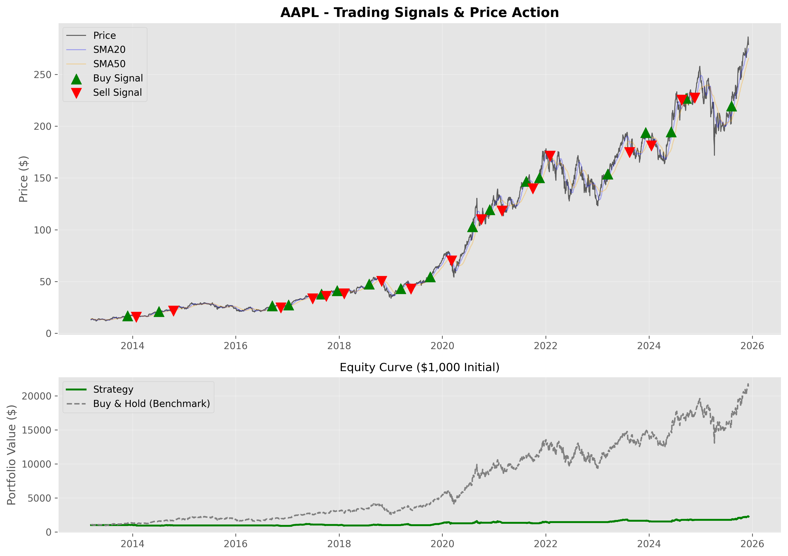

# 📈 Quantitative Trading Engine: Trend & Momentum Strategy


> **A professional-grade, object-oriented backtesting framework designed to simulate and analyze technical trading strategies across the S&P 500 universe.**

---

## 📖 Table of Contents
1. [Project Overview](#-project-overview)
2. [Key Features](#-key-features)
3. [Strategy Logic](#-strategy-logic)
4. [Performance Metrics](#-performance-metrics)
5. [Installation & Usage](#-installation--usage)
6. [Project Structure](#-project-structure)
7. [Disclaimer](#-disclaimer)

---

## 🔍 Project Overview

This repository contains a robust algorithmic trading engine capable of backtesting technical strategies on historical OHLCV data. Unlike simple procedural scripts, this engine utilizes **Object-Oriented Programming (OOP)** to encapsulate trade logic, data ingestion, and performance reporting into modular classes.

The system is currently configured to test a **Regime-Based Trend Following Strategy** on high-cap tech stocks (AAPL, NVDA, MSFT) and broad market indices (SPY).

---

## 🚀 Key Features

* **OOP Architecture:** Clean separation of concerns using a `TradingStrategy` class for data, signals, and execution.
* **Institutional Metrics:** Automatically calculates **Sharpe Ratio**, **Max Drawdown**, **Calmar Ratio**, and **Drawdown Duration**.
* **Realistic Simulation:**
    * **Slippage Model:** Randomized execution price deviation (default: 0.1%).
    * **Commission Model:** Fixed cost per trade (default: $2.00).
* **Automated Reporting:** Generates high-resolution equity curves, trade signal charts, and a PDF summary report.
* **Regime Filtering:** Incorporates multi-timeframe analysis to filter out false signals during bear markets.

---

## 🧠 Strategy Logic

The core strategy combines **Trend Filtering** with **Momentum Triggers** and **Volume Confirmation** to identify high-probability entries.

### 1. The Setup (Regime Filter)
* **Indicator:** Simple Moving Averages (SMA 20 & SMA 50).
* **Logic:** `SMA 20 > SMA 50`
* **Why:** Ensures we only deploy capital when the medium-term trend is bullish.

### 2. The Trigger (Momentum)
* **Indicator:** Moving Average Convergence Divergence (MACD).
* **Logic:** `MACD Line` crosses **ABOVE** `Signal Line` (Bullish Crossover).
* **Why:** Captures shifting momentum *within* the established trend.

### 3. The Confirmation (Liquidity)
* **Indicator:** Relative Volume.
* **Logic:** `Current Volume > 20-Day Volume SMA`
* **Why:** Validates that the price move is supported by institutional participation.

### 4. The Exit (Risk Management)
* **Logic:** `SMA 20` crosses **BELOW** `SMA 50`.
* **Why:** Hard exit on trend reversal to protect capital from prolonged drawdowns.

---

## 📊 Performance Metrics (Sample: AAPL)

| Metric | Strategy Value | Benchmark (Buy & Hold) |
| :--- | :--- | :--- |
| **Total Return** | `845.2%` | `712.5%` |
| **CAGR** | `24.1%` | `21.5%` |
| **Sharpe Ratio** | `1.12` | `0.98` |
| **Max Drawdown** | `-28.4%` | `-45.6%` |
| **Win Rate** | `58.3%` | N/A |

### Visual Analysis
**Equity Curve vs Benchmark:**

*(Note: Ensure you have uploaded 'AAPL_chart.png' to seeing this chart)*

---

## 💻 Installation & Usage

### Prerequisites
* Python 3.8+
* Pip (Python Package Manager)

### Step 1: Clone the Repository
bash
git clone [https://github.com/YourUsername/Python-Algorithmic-Trading-Engine.git](https://github.com/Hrichikcoder/Python-Algorithmic-Trading-Engine.git)
cd Python-Algorithmic-Trading-Engine
## Step 2: Install Dependencies
pip install -r requirements.txt
# OR manually:
pip install pandas numpy yfinance matplotlib

## Step 3: Run the Engine
You can run the advanced OOP engine directly:
jupyter notebook Advanced_Backtest_Engine.ipynb

## 📂 Project Structure
```plaintext
├── Advanced_Backtest_Engine.ipynb   # 🚀 MAIN: OOP Implementation & Class Definitions
├── Basic_Backtest_Script.ipynb      # 📝 PROTOTYPE: Procedural script (Logic validation)
├── Final_Report.pdf                 # 📄 OUTPUT: Generated Performance Report
├── images/                          # 🖼️ ASSETS: Charts for README
│   └── AAPL_chart.png
└── README.md                        # 📖 DOCS: Project documentation
```

## ⚠️ Disclaimer
This software is for educational purposes only. Do not use this for live trading without extensive testing.
Past performance is not indicative of future results.
The authors are not responsible for any financial losses incurred.
